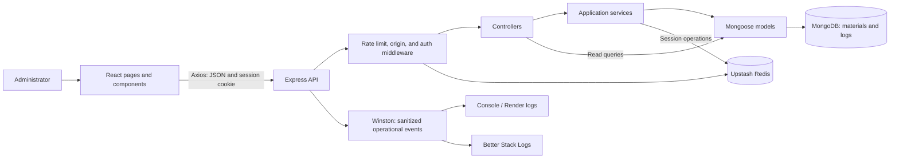

# Phoebe's Crafts Inventory Management System


A responsive web application for managing craft materials, monitoring stock availability, and reviewing inventory movements. Phoebe's Crafts IMS gives an administrator one workspace for keeping material records accurate, identifying items that need replenishment, and downloading stock history as PDF reports.

The application uses a React frontend and an Express API, with MongoDB for inventory records and Upstash Redis for sessions and rate limits. Production runs both the frontend and backend together as one Render Web Service.

## Contents

- [Features and workflows](#features-and-workflows)
- [Tech stack](#tech-stack)
- [Web design](#web-design)
- [System design and architecture](#system-design-and-architecture)
- [Data model and inventory rules](#data-model-and-inventory-rules)
- [Repository structure](#repository-structure)
- [Getting started](#getting-started)
- [API reference](#api-reference)
- [Deployment on Render](#deployment-on-render)
- [Logging and monitoring](#logging-and-monitoring)
- [Testing and verification](#testing-and-verification)
- [Operational considerations](#operational-considerations)
- [Asset attribution](#asset-attribution)

## Features and workflows

### Authentication

A single administrator signs in using credentials configured on the server. Session restoration keeps the workspace available after a page refresh; sign-out revokes the session and returns the user to the login page. Protected API routes enforce authentication independently of frontend navigation.

Passwords and session tokens are not persisted in browser storage. The current system uses one configured admin account; it has no registration or role-management workflow.

### Dashboard

- Total number of material records.
- Counts of In Stock, Low Stock, and Out of Stock materials.
- The five most recently created materials, showing name, category, stock, and status.
- Manual refresh, loading skeletons, empty states, and useful error feedback.

Dashboard totals cover the entire inventory, not just the current inventory page. An empty database displays zero totals. A failed refresh retains and labels previously loaded data instead of replacing it with misleading zeros.

### Inventory management

- Add a material with a name, category, and starting stock.
- Browse materials in a table with **20 records per page**, newest first.
- Filter by an exact stored category; available categories come from the full inventory.
- Increase or decrease stock using labeled Lucide action icons.
- Edit material names and categories.
- Delete a material through a confirmation dialog.

Filtering returns to page one and updates pagination to reflect matching records. Deleting the final row on the last page moves the interface to a remaining valid page. The edit dialog updates metadata; separate stock controls handle quantity changes.

### Inventory logs and reporting

The logs page displays **20 movements per page** with date and time, material name, Stock in or Stock out, quantity, previous stock, and resulting stock. Dates are displayed in **Asia/Manila (UTC+08:00)**.

**Download PDF** exports the captured history across all pages as a landscape A4 report with repeated table headers and page numbers. PDF generation takes place in the browser after retrieving JSON from the API; the PDF libraries and report font load on demand.

**Clear logs** requires confirmation and deletes only history through the captured date/ID boundary. Movements created after that boundary remain available. Clearing history does not change current stock quantities.

### Request feedback

Shared request handling provides session-expiration messages, toast notifications, inline validation, retry controls, skeleton loaders, and rate-limit notices. A cooldown disables affected request controls while keeping editable fields and cancellation available. Requests are not queued or automatically replayed after the cooldown.

## Tech stack

Versions below describe the major versions declared in the repository manifests. Exact installed versions are recorded in the backend and frontend lockfiles.

| Area | Technology | Responsibility |
| --- | --- | --- |
| Runtime | Node.js 24, npm | Backend execution, dependency installation, and build commands |
| Frontend | React 19, Vite 8 | UI components, development server, and production bundle |
| Routing | React Router 8 | Login and protected workspace routes |
| HTTP client | Axios 1 | Cookie-based requests, cancellation, timeouts, and cooldown interceptors |
| Interface | CSS, Lucide React, React Hot Toast | Responsive layouts, icons, and notifications |
| PDF reports | jsPDF 4, jsPDF-AutoTable 5 | PDF generation and paginated report tables |
| Backend | Express 5 | HTTP routes, middleware, and production static-file serving |
| Database | MongoDB, Mongoose 9 | Schemas, queries, indexes, and transactions |
| Session and limit store | Upstash Redis REST client | Session records and distributed rate-limit counters |
| Configuration | dotenv, environment variables | Local and production configuration |
| Operational logging | Winston 3, Better Stack Logtail | Structured console logs and batched remote delivery |
| Development and checks | Nodemon, ESLint 10, Node test runner | Backend reloads, frontend linting, and automated verification |
| Deployment | Render Web Service | One service for the API and built frontend |

See [root scripts](package.json), [backend dependencies](backend/package.json), and [frontend dependencies](frontend/package.json).

## Web design

The interface follows a minimalist visual style with generous spacing, restrained borders, clear typography, and pink brand accents. Shared CSS variables define the palette and spacing.

| Color | Purpose |
| --- | --- |
| `#e46f80` | Primary brand accent |
| `#e9cad2` | Soft accent backgrounds |
| `#ffffff` | Main canvas and surfaces |
| `#d2d2d0` | Borders and decorative loading elements |
| `#000000` | Primary text and focus indicators |

Body text uses a system sans-serif stack; display headings use Georgia with serif fallbacks. The supplied Phoebe logo appears in the brand, account image, and favicon. Noto Sans is used for exported PDFs only.

Desktop layouts use a persistent sidebar. Below the **64rem** desktop breakpoint, a sticky navbar provides a hamburger button that opens a modal navigation drawer containing Dashboard, Inventory, Inventory logs, and Sign out. Tables become stacked records on narrow screens while retaining their labels and actions.

Accessibility provisions include semantic tables and headings, labeled inputs and icon buttons, keyboard focus indicators, a skip link, native modal dialogs, focus restoration, reduced-motion support, and screen-reader loading/error messages. Drawer interaction locks background scrolling. Decorative skeletons are hidden from assistive technology, and countdown ticks are not announced every second.

## System design and architecture

### System boundaries

The browser owns presentation and temporary UI state. Express is the trusted boundary for authentication, validation, stock operations, and HTTP responses. MongoDB is the source of truth for materials and movement history. Redis stores expiring sessions and request counters; the frontend cooldown store is advisory and does not replace server enforcement.

Production serves the React bundle and API from the same origin. Development uses separate Vite and Express ports with explicitly configured credentialed CORS.



### Application layers

| Layer | Location | Responsibility |
| --- | --- | --- |
| Presentation | `frontend/src/pages`, `components`, `styles` | Page layouts, reusable controls, dialogs, and responsive styling |
| UI state | `frontend/src/auth`, `hooks` | Session state, data loading, pagination, filtering, and cooldown subscriptions |
| Client integration | `frontend/src/services`, `utils` | API calls, response validation, user-facing errors, and PDF reports |
| HTTP boundary | `backend/src/routes`, `controllers`, `middleware` | Endpoint mapping, request validation, access checks, and response handling |
| Application operations | `backend/src/services` | Transactional stock changes, dashboard/log aggregation, and session operations |
| Persistence and rules | `backend/src/models`, `utils` | Schemas, stock status calculation, log consistency, and input constraints |
| Infrastructure | `backend/src/config`, `app.js`, `server.js` | Database/Redis clients, Winston logging, environment configuration, middleware composition, and startup |

Read operations use Mongoose queries in controllers or services. Stock writes go through the inventory service, which owns the transaction joining material updates with log creation. The inventory model calculates status when a material is saved.

### Stock movement flow

1. The UI validates a quantity and sends an authenticated stock adjustment.
2. The backend validates the item ID and positive whole quantity.
3. A MongoDB transaction reads the latest material and checks stock bounds.
4. The service saves the updated stock and corresponding movement log in that transaction.
5. After a successful response, the page reloads its inventory data.

Transactions use snapshot reads and majority writes. Transaction attempts re-read the material, and optimistic concurrency is enabled on inventory documents. A decrease cannot exceed available stock. A stock update and its corresponding log commit together or roll back together.

### Authentication and request protection

- Node's scrypt verifies the configured password hash using a timing-safe comparison.
- Sessions use random tokens; Redis keys contain token hashes rather than the raw token.
- Sessions expire after **eight hours**. Changing configured credentials invalidates existing sessions.
- Cookies are HTTP-only and `SameSite=Strict`; production adds `Secure` and a `__Host-` cookie name.
- Browser mutations are checked against the API origin or configured frontend origin.
- The global limit is **100 API requests per IP per minute**. Login also allows **5 attempts per IP per 15 minutes**, including successful logins.
- Redis counters increment and receive expiry atomically. Redis failures return `503` instead of bypassing protection.
- `429` responses include `Retry-After`, `X-RateLimit-Scope`, and `Cache-Control: no-store`.
- Backend error handling returns safe messages without exposing connection strings or database error details.

The Axios client sends cookies and normally uses a ten-second timeout. JSON log exports allow sixty seconds. Its in-memory cooldown state is shared across navigation in the current tab; the backend still enforces limits across refreshes and other clients.

## Data model and inventory rules

### Materials

| Field | Meaning |
| --- | --- |
| `_id` | MongoDB material identifier |
| `itemName` | Required, trimmed material name |
| `category` | Required, trimmed category label |
| `stock` | Nonnegative safe integer |
| `status` | Status derived from stock |
| `createdAt`, `updatedAt` | Server-maintained timestamps |

| Stock quantity | Status |
| --- | --- |
| `0` | Out of Stock |
| `1–10` | Low Stock |
| `11+` | In Stock |

The low-stock threshold is currently fixed at ten. Categories are stored labels; filters use exact, case-sensitive matches after trimming. Indexes support newest-first ordering and category/newest-first queries.

### Movement history

Each log stores `inventoryId`, a saved `itemName`, `actionType` (`ADD` or `REMOVE`), `quantity`, `previousStock`, `newStock`, and timestamps. Log validation checks that the before/after values match the recorded adjustment. The saved material name remains available after a rename or deletion.

Creating a material with positive starting stock produces a Stock in log from zero. Creating one with zero stock produces no movement. Deleting a material with remaining stock records its removal to zero and preserves previous logs.

Inventory and log pages sort by `createdAt` and `_id` descending. The UI requests twenty records; the API caps page size at one hundred. Exporting and clearing use a captured timestamp/ID boundary. Repeating a clear request for the same boundary is safe, though removed history cannot be recovered through the application.

## Repository structure

```text
phoebes-crafts-ims/
|-- README.md
|-- package.json               # Combined production build/start scripts
|-- backend/
|   |-- package.json
|   |-- package-lock.json
|   |-- src/
|   |   |-- config/
|   |   |-- controllers/
|   |   |-- middleware/
|   |   |-- models/
|   |   |-- routes/
|   |   |-- services/
|   |   |-- utils/
|   |   |-- app.js
|   |   `-- server.js
|   `-- test/
`-- frontend/
    |-- package.json
    |-- package-lock.json
    |-- public/                # Brand logo and public assets
    |-- src/
    |   |-- assets/            # PDF font and attribution
    |   |-- auth/
    |   |-- components/
    |   |-- hooks/
    |   |-- pages/
    |   |-- services/
    |   |-- styles/
    |   |-- utils/
    |   |-- App.jsx
    |   `-- main.jsx
    `-- test/
```

## Getting started

### Prerequisites

- Node.js **24.12 or later within Node 24**, matching the root engine range.
- npm and access to MongoDB and Upstash Redis.
- MongoDB configured to support multi-document transactions, such as an Atlas replica set.
- A configured administrator username and compatible scrypt password hash.

### Install dependencies

From the repository root:

```sh
npm ci --prefix backend --include=dev
npm ci --prefix frontend --include=dev
```

These commands use the committed lockfiles and install development tools for both applications.

### Configure local development

Create `backend/.env` with your own values:

```dotenv
MONGO_URI=your-mongodb-connection-string
UPSTASH_REDIS_REST_URL=https://your-database.upstash.io
UPSTASH_REDIS_REST_TOKEN=your-upstash-rest-token
ADMIN_USERNAME=your-admin-username
ADMIN_PASSWORD_HASH=your-valid-scrypt-password-hash
FRONTEND_ORIGIN=http://localhost:5173
PORT=5001
NODE_ENV=development
```

The credential and connection values above are placeholders. For an existing installation, copy its valid password hash exactly. A new hash must match `scrypt$32768$8$3$<salt-hex>$<hash-hex>`, using a 16-byte salt and a 64-byte derived key. The backend validates this format at startup.

All `.env` files and variants are ignored by Git. Keep credentials in the backend environment. Values prefixed with `VITE_` are public and become part of the browser build.

### Start the application

Run the backend in one terminal, from the repository root:

```sh
npm run dev --prefix backend
```

Run Vite in another terminal:

```sh
npm run dev --prefix frontend
```

Open [http://localhost:5173/login](http://localhost:5173/login). The development API defaults to `http://localhost:5001/api`; Vite uses strict port `5173`.

If changing the API address, set `VITE_API_BASE_URL` in `frontend/.env.local` and restart Vite. Match `FRONTEND_ORIGIN` to the actual frontend origin. Use `localhost` consistently for both applications so the strict session cookie stays usable.

## API reference

Application endpoints use the `/api` prefix. Inventory endpoints and `/auth/me` require an admin session. All API requests pass through the global limiter; mutations also pass through the trusted-origin check. The health route is outside these guards.

Responses include a server-generated `X-Request-ID` for correlating requests with operational logs. Development CORS exposes that header to the frontend. Client-supplied request IDs are not trusted.

| Method | Endpoint | Purpose |
| --- | --- | --- |
| GET | `/health` | Public process liveness |
| POST | `/api/auth/login` | Sign in with `username` and `password` |
| GET | `/api/auth/me` | Restore or inspect the current admin session |
| POST | `/api/auth/logout` | Revoke the presented session and clear its cookie |
| GET | `/api/inventory/dashboard` | Global counts and five newest materials |
| GET | `/api/inventory/categories` | Discover stored categories |
| GET | `/api/inventory` | List materials with optional category filter |
| POST | `/api/inventory` | Create a material |
| GET | `/api/inventory/:id` | Retrieve one material |
| PUT | `/api/inventory/:id` | Update supplied material fields |
| PATCH | `/api/inventory/:id/increase` | Increase stock by `quantity` |
| PATCH | `/api/inventory/:id/decrease` | Decrease stock by `quantity` |
| DELETE | `/api/inventory/:id` | Delete a material while retaining history |
| GET | `/api/inventory/logs/all` | Paginated movement history |
| GET | `/api/inventory/logs/export` | Stream JSON used by PDF generation |
| DELETE | `/api/inventory/logs/all` | Clear explicitly confirmed captured history |

The update API accepts supplied `itemName`, `category`, or `stock` fields. The frontend's edit form submits only metadata; stock changes use the adjustment endpoints.

Paginated inventory example:

```text
GET /api/inventory?paginated=true&page=1&limit=20&category=Beads
```

Its response contains `items`, `currentPage`, `pageSize`, `totalItems`, and `totalPages`. Paginated logs use `paginated=true&page=1&limit=20` and return `logs`, the same page metadata, `totalLogs`, and `clearThrough`. Omitting `paginated` preserves the older response shapes.

Clear requests require `confirm: "CLEAR"`, `throughId`, and an ISO UTC `throughCreatedAt`. Optional export boundary parameters select the same captured history. The export endpoint returns JSON; the frontend creates the PDF.

Errors use `{ "message": "..." }`. Status codes distinguish invalid input (`400`), authentication (`401`), rejected origins (`403`), missing resources (`404`), conflicting writes (`409`), rate limits (`429`), unavailable authentication/limiting (`503`), and other server failures (`500`).

## Deployment on Render

Create one **Node Web Service** for the repository:

| Setting | Value |
| --- | --- |
| Root directory | Leave empty (repository root) |
| Build command | `npm run build` |
| Start command | `npm start` |
| Health check path | `/health` |

The root build installs backend runtime dependencies, installs frontend build dependencies explicitly, and builds `frontend/dist`. Express serves that directory using a module-relative path. Frontend routes fall back to React's `index.html`; API errors and missing assets retain their HTTP responses.

### Required environment values

Add these five values in Render's Environment settings:

| Variable | Value |
| --- | --- |
| `MONGO_URI` | Production MongoDB connection string |
| `UPSTASH_REDIS_REST_URL` | Production Upstash REST URL |
| `UPSTASH_REDIS_REST_TOKEN` | Production Upstash REST token |
| `ADMIN_USERNAME` | Configured admin username |
| `ADMIN_PASSWORD_HASH` | Complete compatible scrypt hash |

Render's Node runtime supplies `NODE_ENV=production` at runtime, and its Web Service supplies `PORT`. They do not need manual entries for this setup. If setting `NODE_ENV` explicitly, use `production`. [Render environment defaults](https://render.com/docs/environment-variables)

Leave `FRONTEND_ORIGIN` **unset** for this combined deployment, or set an exact HTTPS origin such as `https://your-service.onrender.com`. A localhost URL, trailing slash, or page path causes startup validation to fail. Keep localhost values in local development only.

Leave `VITE_API_BASE_URL` unset so production uses same-origin `/api`. The root engine range selects Node 24; conflicting `NODE_VERSION` overrides should be removed or changed to a matching version. [Render Node version selection](https://render.com/docs/node-version)

Allow the service's outbound IP ranges in MongoDB Atlas network access. Render lists them under the service's **Connect > Outbound** panel. MongoDB and Upstash must be reachable from the service. [Render outbound IP documentation](https://render.com/docs/outbound-ip-addresses)

Production binds to `0.0.0.0` and trusts one proxy hop for client IP resolution. If the proxy topology changes, review that trust setting. Backend startup waits for MongoDB before listening. `/health` reports process liveness, not database or Redis readiness.

After deployment, verify health, login, session restoration, direct page refreshes, and sign-out. Check inventory writes against the production database when you intend to create those records. Environment-only corrections can be applied through Render's **Save and deploy** option. [Render environment configuration](https://render.com/docs/configure-environment-variables)

## Logging and monitoring

Operational logs use Winston and the official Better Stack transport. They are separate from the inventory movement history stored in MongoDB and displayed on the Inventory logs page.

### Configure Better Stack

Add the following values to `backend/.env` locally and to Render's **Environment** settings for production. Local `.env` files are ignored by Git and are not deployed.

| Variable | Purpose |
| --- | --- |
| `BETTER_STACK_SOURCE_TOKEN` | Secret token from your Better Stack source |
| `BETTER_STACK_INGESTING_HOST` | Source-specific ingesting hostname, or its HTTPS origin; no credentials, path, query, or fragment |
| `LOG_LEVEL` | Optional: `error`, `warn`, `info`, or `debug`; defaults to `info` |

Use the exact ingesting host displayed for your source rather than assuming a shared endpoint. The logger accepts either `your-ingesting-host` or `https://your-ingesting-host`. [Better Stack Winston integration](https://betterstack.com/docs/logs/javascript/winston/)

Console logging remains active when Better Stack is unconfigured or unavailable. Invalid remote configuration produces a local warning. Delivery errors produce a local warning at most once per minute, without interrupting API requests. Remote delivery uses bounded batches, queues, timeouts, and retries; it is best effort rather than a durable audit archive.

### Events and diagnostics

Each JSON record includes `timestamp`, `level`, `service`, `environment`, `event`, and `message`. Request-scoped events include `request_id`; the HTTP summary also records method, server-defined route template, status, duration in milliseconds, and authentication state.

| Event family | Examples and purpose |
| --- | --- |
| HTTP | `http.request.completed`, `http.request.aborted`: status, latency, and interrupted responses |
| Authentication | `auth.login_succeeded`, `auth.login_rejected`, `auth.logout_succeeded`, `auth.storage_unavailable` |
| Inventory | `inventory.material_created`, `inventory.material_updated`, `inventory.material_deleted`, `inventory.stock_increased`, `inventory.stock_decreased` |
| History | `inventory.logs_cleared`, `inventory.logs_exported` |
| Database and startup | `database.connected`, `database.disconnected`, `database.reconnected`, `database.error`, `server.started`, `server.startup_failed` |
| Monitoring | `process.health`: uptime, resident memory, heap usage, and MongoDB connection state every sixty seconds |
| Failures and shutdown | `http.request_failed`, `rate_limit.unavailable`, `process.unhandled_rejection`, `process.uncaught_exception`, `server.shutdown_*` |

Successful API requests log at `info`, client failures at `warn`, and server failures at `error`. Successful health checks and static-file requests log at `debug` to reduce routine noise. Selecting `warn` or `error` also filters health snapshots and successful action events.

Logs omit request/response bodies, headers, cookies, usernames, IP addresses, raw URLs, and query strings. Stock events use material IDs and quantities rather than material names. Error diagnostics retain a safe type/code, application file/line locations, and recognized configuration failure reasons; raw error messages, full stacks, and absolute paths are excluded. A shared sanitizer also redacts sensitive keys and configured secret values and bounds nested metadata.

On `SIGTERM` or `SIGINT`, the server stops accepting requests, drains connections, disconnects MongoDB, and attempts to flush buffered logs before exiting. Shutdown has a fifteen-second deadline. Fatal runtime errors follow the same cleanup path and exit unsuccessfully so the hosting platform can restart the process.

### Verify and monitor

After starting or redeploying, inspect Better Stack **Live tail** for `server.started`, `database.connected`, and subsequent `process.health` events. Perform a normal API request and use its `X-Request-ID` to correlate the HTTP summary with related action or error events. If logs appear only in Render, check for `logging.configuration_invalid` or `logging.delivery_failed` and verify both source settings.

Configure uptime checks for the public `/health` URL and alert rules in Better Stack separately. Useful signals include repeated server errors, sustained high request duration, database disconnects, or missing health snapshots. `/health` verifies process liveness; it does not probe MongoDB or Redis. This repository emits telemetry but does not provision external dashboards, alerts, or uptime checks.

## Testing and verification

Run the deployment check from the repository root:

```sh
npm run test:deployment
```

It builds the real frontend, then exercises production routing, JavaScript/CSS/logo serving, API error behavior, secure login/session/sign-out, proxy-based limits, dependency failures, liveness, and server startup using mocked external services.

Run the remaining backend checks from the root:

```sh
node --test --test-concurrency=1 backend/test/configSecurity.test.js backend/test/cors.test.js backend/test/dashboard.test.js backend/test/inventoryPagination.test.js backend/test/logs.test.js backend/test/logging.test.js
```

Run frontend checks from the `frontend` directory:

```sh
cd frontend
npm run lint
node --test --test-concurrency=1 test/auth.test.js test/dashboard.test.js test/inventory.test.js test/logs.test.js test/rateLimit.test.js test/navigation.test.js
```

Backend tests mock Redis transport and relevant database operations. Frontend tests mock HTTP responses and cover validation, API contracts, semantic rendering, pagination, cooldowns, navigation, and real PDF generation. These checks do not modify live inventory.

Logging tests cover structured output, credential redaction, isolated request IDs, failed and interrupted requests, remote delivery failures/timeouts, log levels, and graceful/fatal shutdown. Better Stack delivery is disabled in the Node test context, including deployment tests, to prevent test telemetry from reaching a real source.

Browser verification remains a separate step. Check desktop/mobile widths, keyboard navigation, modal focus, drawer dismissal, reduced motion, and 200% zoom, along with primary data workflows and error states. Offline tests do not verify Render credentials, production connectivity, or live MongoDB transaction behavior.

## Operational considerations

- **Data integrity:** stock writes and their movement logs share a transaction; the MongoDB deployment must support transactions.
- **History retention:** material deletion preserves logs, but confirmed log clearing permanently removes captured history. Download required reports before clearing.
- **Export size:** the API streams logs with a bounded database cursor, while the browser holds the exported history to generate a PDF. Large reports consume memory proportional to the record count.
- **Pagination:** the application uses bounded offset pagination with indexed ordering. Dashboard counts cover all material records.
- **Retries:** duplicate form submissions are blocked. An uncertain mutation result requires closing the dialog and refreshing before another attempt; mutations are not automatically replayed.
- **Monitoring:** structured logs, request durations, dependency events, and periodic process health snapshots are available in console output and configured Better Stack sources. External alerting, uptime checks, backup scheduling, and recovery automation require deployment/account configuration.

## Asset attribution

The Phoebe brand logo is included at [frontend/public/pb-logo.png](frontend/public/pb-logo.png).

PDF reports embed Noto Sans Regular from the [Noto font project](https://github.com/notofonts/noto-fonts). Its [SIL Open Font License 1.1](frontend/src/assets/NotoSans-LICENSE.txt) and [asset attribution](frontend/src/assets/README.md) are retained with the font.
